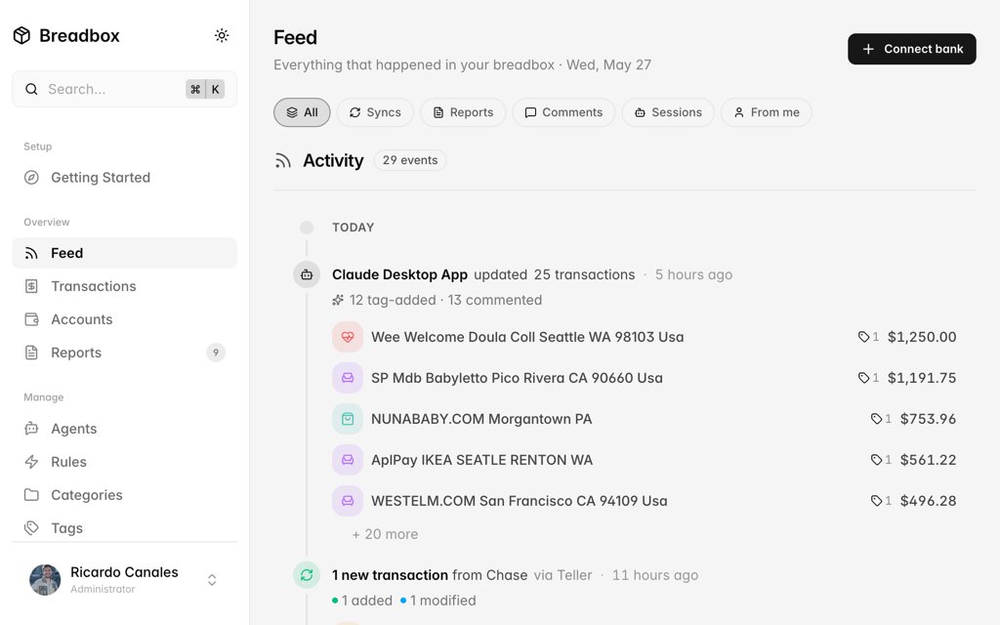
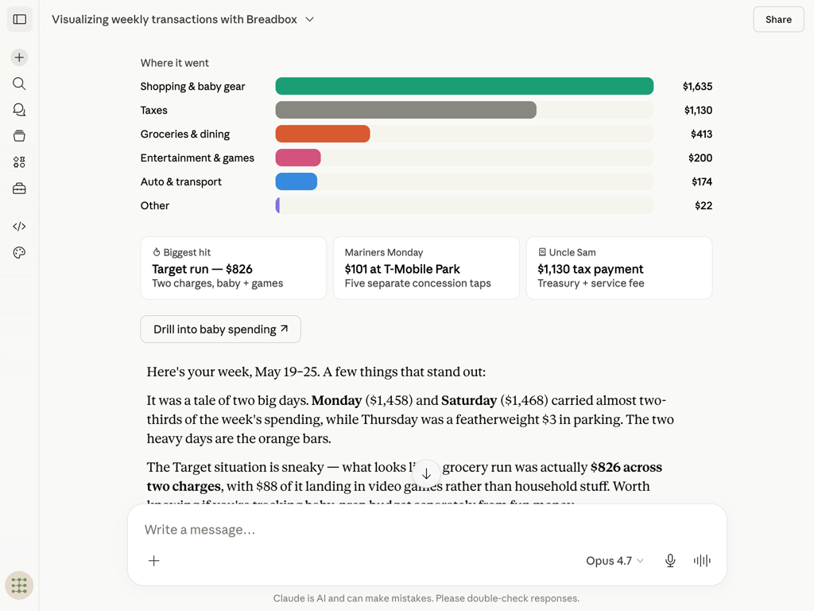

# Breadbox

Self-hosted financial data store with an MCP server.

<!-- Recommended: 1600x1000 PNG, embedded at width=840 -->


## What it is

- **MCP server** for AI agents — Streamable HTTP at `/mcp` and stdio via
  `breadbox mcp`, with scoped API keys and per-tool read/write permissions
- **Built-in agent runtime** — schedule [Claude Agent SDK](https://docs.claude.com/en/api/agent-sdk/overview)
  runs that call breadbox MCP to enrich, categorize, and review transactions;
  cron / sync-complete / on-demand triggers, per-run cost + turn caps, full
  NDJSON transcripts. Bring your own Anthropic API key or OAuth subscription
  token.
- **REST API** — every endpoint under `/api/v1/*` with cursor pagination,
  field selection, and filtering. Specified in [`openapi.yaml`](openapi.yaml).
- **Admin dashboard** — connection management, sync monitoring, transaction
  review queue, rule engine with recursive AND/OR/NOT conditions
- **Pluggable bank sync** — provider interface feeding a single normalized
  transaction store; integrations and a CSV importer ship today, more on the
  roadmap
- **Multi-user household** — admin + family members, attribution-aware
  filtering, account linking for cross-connection deduplication
- **AES-256-GCM** encryption for provider credentials at rest
- **Single binary** — Go server hosting API, MCP, dashboard, webhooks, and
  cron in one process

## Quick start

```bash
curl -fsSL https://breadbox.sh/install.sh | bash
```

Detects your OS, installs Docker if needed, prompts for a domain (or leaves it
localhost-only), generates secrets, and brings up the stack. Visit `/setup`
to create your admin account.

Full install docs (binary download, source, manual Docker, daemon
registration): **[docs.breadbox.sh/install](https://docs.breadbox.sh/install)**.

## AI agents

<!-- Recommended: 1400x900 PNG -->


Point any MCP client at `https://your-host/mcp` with an API key. Read
transactions, apply categories, write rules, surface anomalies — without the
agent ever touching bank credentials.

Or let Breadbox run the agents itself: the built-in runtime ships with five
starter agents (Initial Setup, Bulk Review, Quick Review, Routine Review,
Spending Report) and a prompt builder for your own. See the
[multi-agent reviewer guide](https://docs.breadbox.sh/guides/multi-agent-reviewer).

## Documentation

- **[docs.breadbox.sh](https://docs.breadbox.sh)** — install, providers, agents, API
- [`docs/`](docs/) in this repo — engineering specs (data model, architecture, MCP tools, rule DSL)
- [`CONTRIBUTING.md`](CONTRIBUTING.md) — development setup

## License

[AGPL-3.0](LICENSE)
